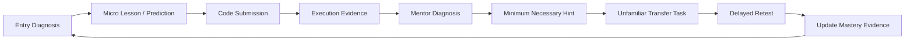
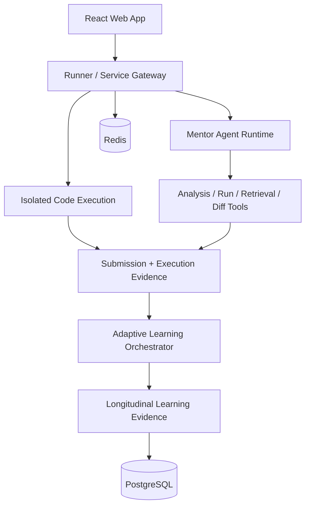

<div align="center">

# 汇森AI · Huisen AI

### Evidence-Driven Adaptive Algorithm Coach

**不是帮你做出这道题，而是让你独立做出下一道题。**

An adaptive learning system that uses code execution, mentor-agent evidence, transfer tasks and delayed retesting to distinguish “received help” from “independently mastered.”

`React` · `TypeScript` · `Mentor Agent` · `Judge0` · `PostgreSQL` · `Redis` · `Docker`

[Product Demo](https://github.com/Benjamindaoson/huisen-ai-adaptive-algorithm-coach/releases/tag/goai-2026-submission-v1) · [Full README](../README.md) · [Mentor Runtime](../docs/architecture/mentor-agent-runtime.md) · [Deployment](../docs/deployment.md)

</div>

---

## Demo

<p align="center">
  
</p>

The product flow observes an actual learning attempt, identifies the current bottleneck, gives the minimum necessary intervention, and then asks for **transfer on a different surface form** instead of treating a helped solution as mastery.

## Learning Loop



## Evidence — what is actually implemented

| Capability | Current state |
|---|---|
| Unified learning product | daily tasks, training workspace, problem bank, error review, mock assessment, project practice and progress replay |
| Searchable content | **754 problems** are indexed, with content/judging quality tracked separately |
| Code execution | Java, Python, JavaScript and C++; full stack can use isolated Judge0 execution |
| Mentor Agent | operates on immutable submission snapshots and can bind tool calls, evidence, code diffs and stop reasons |
| Adaptive scheduling | uses errors, hint dependency, transfer performance and forgetting interval as learning signals |
| Learning evidence | local persistence/export when anonymous; server-side identity and persistence in the full stack |
| Engineering quality | tests, lint, type checking, web build and formal Mentor quality gate |

## What makes the Mentor different

The Mentor does not simply inspect the current editor and generate an answer. It works against a frozen submission state:

```text
Problem + submitted code + execution result + learning history
                         ↓
                 Mentor hypothesis
                         ↓
          structure / run / retrieval tools
                         ↓
                evidence-supported diagnosis
                         ↓
                 minimal teaching action
                         ↓
               observe the next attempt
```

If model services are unavailable, the UI reports the degraded state rather than pretending an AI diagnosis occurred.

## Validation Boundary

The repository deliberately separates **implemented product capability** from **proven learning effectiveness**.

At the current public state:

- not all 754 problems have equally strong hidden judging;
- the real teacher-adjudicated diagnosis set is still **0/100**;
- therefore the project does **not** claim that learning outcomes have already been validated on real users.

This limitation is part of the quality contract, not hidden from the README.

## Architecture



The deeper architecture diagram and design rationale remain in the [full technical README](../README.md).

## Quick Start

Credential-free product experience:

```powershell
git clone https://github.com/Benjamindaoson/huisen-ai-adaptive-algorithm-coach.git
cd huisen-ai-adaptive-algorithm-coach
npm ci
npm --prefix web ci
npm run build:corpus
npm --prefix web run dev -- --host 127.0.0.1
```

Full local stack:

```powershell
Copy-Item services/runner/.env.example services/runner/.env
npm run stack:up
npm run stack:smoke
npm --prefix web run dev -- --host 127.0.0.1
```

For model configuration, isolated execution, content quality, persistence and deployment boundaries, continue to the **[full README](../README.md)**.

---

<div align="center">

**Diagnose → intervene minimally → verify transfer → retain evidence**

</div>
