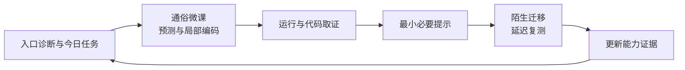
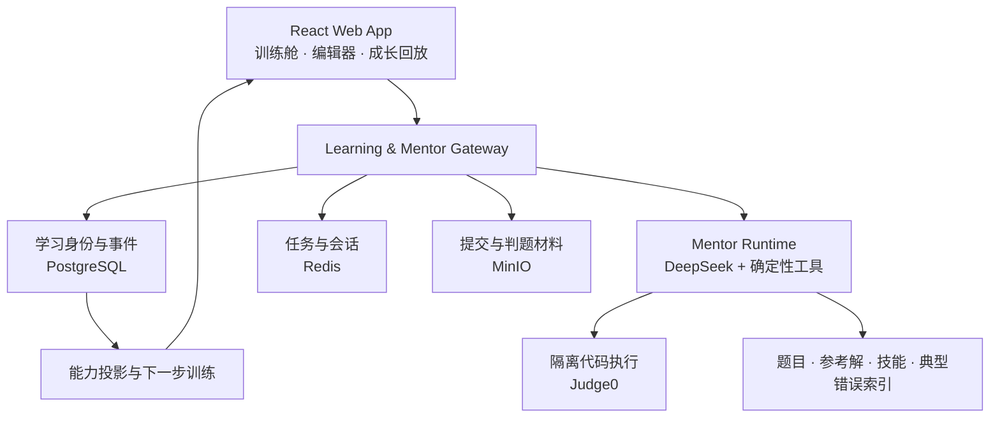

<div align="center">

# 汇森AI

### 自适应个性化 AI 算法教练

**不是帮你做出这道题，而是让你独立做出下一道题。**

面向零基础、非科班和算法学习受挫者，把“听懂了”训练成“能独立完成、能迁移、能用到真实任务中”。

[产品演示](#产品演示) · [快速开始](#快速开始) · [学习闭环](#它如何工作) · [系统架构](#系统架构) · [深入文档](#深入文档)


</div>

<p align="center">
  
</p>

## 学算法，难的不是找到答案

真正困难的是：不知道自己卡在哪里、看懂题解却写不出来、会做原题却不会做换了表面的题。

汇森AI 不把“完成更多题”当作学习目标。系统根据每次提交、运行结果、提示依赖和迁移表现，持续回答三个问题：

| 更容易学会 | 更牢固掌握 | 真正用出来 |
|---|---|---|
| 把抽象算法拆成通俗微课、状态预测和局部编码 | 用最小提示、陌生迁移题和延迟复测检验独立掌握 | 从单题走向模拟考试与多文件项目实训 |

## 产品演示

看 AI 如何理解一次真实学习过程：判断当前卡点，安排 10 分钟训练，观察代码运行，只给必要提示，再用不同表面的任务验证是否真正学会。

https://github.com/user-attachments/assets/92ee2524-0ac4-42a7-9ea9-aed626db0a90

[观看 1080p 原版与版本说明](https://github.com/Benjamindaoson/huisen-ai-adaptive-algorithm-coach/releases/tag/goai-2026-submission-v1)

## 它如何工作



掌握度不会因为“看过课程”或“在帮助下通过”自动提高。只有可解释的学习事件，尤其是独立迁移和延迟复测，才会改变后续训练安排。

## 核心体验

| 能力 | 学习者实际感受到什么 |
|---|---|
| **AI 入门诊断** | 根据目标、基础、时间和首轮操作生成第一项训练，而不是先填一份冗长问卷 |
| **沉浸式训练舱** | 在一个单元内完成通俗讲解、状态预测、局部编码、运行观察和迁移挑战 |
| **证据驱动 Mentor** | 明确分析哪次提交、看到了什么、还缺什么证据，以及下一步只需要改哪里 |
| **自适应复练** | 根据错因、提示依赖、迁移结果和遗忘间隔安排下一题，并解释推荐原因 |
| **双模式算法初试** | 分开衡量算法能力、独立完成能力、提示依赖和 AI 协作能力 |
| **项目实训与成长回放** | 从多文件工程任务中形成可追溯的能力证据，回看自己如何从不会到会 |

<table>
  <tr>
    <td width="50%"></td>
    <td width="50%"></td>
  </tr>
  <tr>
    <td align="center"><strong>从理解到独立迁移</strong></td>
    <td align="center"><strong>每条建议都有证据来源</strong></td>
  </tr>
</table>

## Mentor 不是答案生成器

Mentor 围绕一次不可变的提交快照工作，而不是对着当前编辑器泛聊：

1. 读取题目、代码、运行结果、公开用例和学习历史；
2. 选择代码结构分析、运行验证、知识检索或差分检查等工具；
3. 根据工具结果更新假设，证据不足时明确承认；
4. 给出最小必要教学动作，不直接覆盖学生代码；
5. 观察修改后的结果，验证诊断是否成立，并在目标达成后停止。

DeepSeek 未配置或服务不可用时，界面会显示真实降级状态，不用静态文案伪装模型已经运行。

## 快速开始

### 快速体验 Web App

需要 Node.js 24+。这条路径无需模型密钥，可体验题库、教学单元、训练工作台和本地学习记录。

```powershell
git clone https://github.com/Benjamindaoson/huisen-ai-adaptive-algorithm-coach.git
cd huisen-ai-adaptive-algorithm-coach
npm ci
npm --prefix web ci
npm run build:corpus
npm --prefix web run dev -- --host 127.0.0.1
```

打开终端显示的本地地址。真实 Mentor 工具链、服务端身份、持久化和隔离代码执行需要完整后端。

### 启动完整本地栈

需要 Docker Desktop。先复制环境变量模板并替换所有 `replace-with-*` 密码，再启动服务：

```powershell
Copy-Item services/runner/.env.example services/runner/.env
npm run stack:up
npm run stack:smoke
npm --prefix web run dev -- --host 127.0.0.1
```

配置说明、生产安全要求和故障排查见 [本地运行服务](services/runner/README.md) 与 [部署指南](docs/deployment.md)。模型密钥只能保存在服务端，禁止添加 `VITE_` 前缀。

## 系统架构



前端使用 React 19、TypeScript、Vite 和 Monaco Editor；后端网关负责身份、学习事件、Mentor 运行、代码执行与数据边界。核心学习判断从结构化证据投影，不允许模型凭感觉直接修改能力分数。

## 当前状态

| 范围 | 当前事实 |
|---|---|
| 学习产品 | 今日任务、训练舱、题库、错因复练、模拟初试、项目实训和能力回放已接入同一 Web App |
| 内容 | 754 道题进入可搜索内容索引；内容完整度和判题可信度分级管理 |
| 代码执行 | 支持 Java、Python、JavaScript、C++；完整栈可接入隔离 Judge0 |
| 学习数据 | 未登录时支持本地保存与导入导出；登录后支持服务端身份、同步和持久化 |
| Mentor | 可绑定提交快照、工具调用、证据、代码差异和停止原因；无服务时明确降级 |
| 仍需验证 | 并非 754 道题都具备强隐藏判题；真实教师裁决质量集仍为 0/100，因此不宣称学习效果已被真实用户证明 |

## 项目结构

```text
web/                     React Web App
services/runner/         Gateway、身份、Mentor 与隔离执行栈
content/                 结构化题库与技能索引
quality/                 Mentor 与内容质量数据
scripts/                 题库构建、评测和本地栈检查
contracts/               前后端数据契约
docs/                    架构、部署、质量与产品研究
openspec/                规格驱动的变更记录
```

## 开发验证

```powershell
npm test
npm run lint
npm run typecheck
npm run build:web
```

`npm run quality:mentor` 是正式质量门禁：教师裁决样本不足时会按设计返回非零，不应通过关闭门禁来制造“全部通过”。

## 深入文档

- [Mentor Agent Runtime](docs/architecture/mentor-agent-runtime.md)
- [AI 学习智能核心](docs/architecture/ai-learning-intelligence-core.md)
- [部署指南](docs/deployment.md)
- [题库维护](docs/content-maintenance.md)
- [Mentor 实现与证据状态](docs/quality/mentor-os-implementation-status.md)
- [持久化判题状态](docs/quality/m2-durable-judging-status.md)

## 路线图

- 扩展零基础算法过桥课程和不同表面的迁移任务；
- 完成更多可信隐藏判题包与四语言交叉验证；
- 建立 100+ 条真实教师裁决的错误诊断质量集；
- 用迁移独立通过率和延迟复测结果验证学习效果；
- 从算法训练扩展到更完整的 AI 技术项目与岗位能力证明。

## 数据与教育边界

- 学习数据使用公开数据、模拟数据、授权脱敏数据或学习者主动创建的数据；
- AI 反馈用于形成性学习指导，不替代教师、学校、企业或专业机构的最终评价；
- 独立考试、迁移验证和延迟复测会关闭不允许的 Mentor、参考答案和历史信息；
- 导出、删除、模型调用和服务端存储边界必须对学习者可见。

## 参与贡献

欢迎通过 [GitHub Issues](https://github.com/Benjamindaoson/huisen-ai-adaptive-algorithm-coach/issues) 提交问题、学习体验反馈和功能建议。涉及较大改动时，请先说明用户问题、预期行为和验证方式。

当前仓库公开用于产品验证与技术交流，正式开源许可证尚未确定。在顶层 `LICENSE` 发布前，请勿默认获得复制、修改或再分发授权。

---

<div align="center">

**汇森AI：让每一次练习，都为独立解决下一道问题服务。**

</div>
