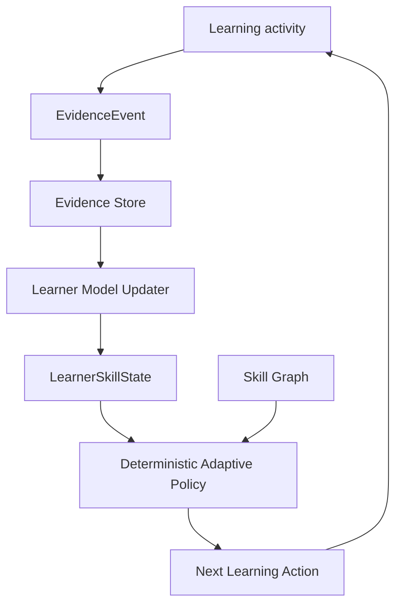

# AI Talents Learning OS

[**English**](README.md) | [中文](README.zh-CN.md)

### Multi-Agent Adaptive Learning System for LLM, RAG, Agents & Embodied AI

**Learn. Build. Prove. Adapt.**

AI Talents Learning OS is an AI-native adaptive learning system that turns real learner actions into skill evidence, maintains a structured learner model, and chooses the next best learning action.

> The product is not organized around course completion. It is organized around what a learner can actually understand, implement, debug, transfer, retain, and prove.

The long-term product scope is focused on four connected domains:

```text
LLM
 ↓
RAG
 ↓
Agents
 ↓
Embodied AI
```

## Core learning loop

```text
Observe learner evidence
        ↓
Decide the next best action
        ↓
Teach / Practice / Debug / Project
        ↓
Verify the result
        ↓
Update the learner model
        ↓
Repeat
```

This corresponds to the product-facing loop:

```text
Diagnose
→ Plan
→ Learn
→ Practice
→ Execute
→ Evaluate
→ Transfer
→ Retest
→ Update Learner Model
→ Choose Next Best Task
```

## P0 + P1: adaptive learning core

The first migration phase intentionally does **not** redesign the UI. It establishes the data and decision contracts that every future Tutor, Project Lab, and Embodied Lab must share.

### Frozen v1 contracts

- `contracts/skill-node.ts` — canonical SkillNode contract for LLM, RAG, Agent, and Embodied AI skills.
- `contracts/learner-skill-state.ts` — evidence-derived learner state.
- `contracts/evidence-event.ts` — unified evidence envelope.
- `contracts/adaptive-learning.ts` — structured learning actions and adaptive decisions.

### Evidence-first learner model

A skill is not represented by `completed = true`.

The v1 learner state tracks:

```text
mastery
uncertainty
concept score
implementation score
debugging score
independent success
hint dependency
transfer score
retention score
evidence count
misconception tags
review timing
```

### Unified EvidenceEvent

Existing learning events are preserved. A compatibility adapter converts the old `LearningEvent` stream into the new evidence model instead of breaking the current product.

```text
Legacy LearningEvent
        ↓
learningEventToEvidence(...)
        ↓
EvidenceEvent
        ↓
Evidence Store
        ↓
Learner Model
        ↓
Adaptive Policy
```

The evidence model is designed to support later sources such as:

- concept checks
- code submissions
- test results
- hint requests
- retrieval traces
- tool traces
- project verification
- transfer tasks
- delayed retests
- simulation results
- robot execution

### Append-only Evidence Store

The first implementation provides an append-only in-memory store with duplicate-ID protection and filtered retrieval.

It is deliberately small. Persistent Postgres integration comes after the contract and projection semantics are stable.

### Deterministic learner-model projection

`LearnerModelUpdater` derives the learner state from evidence rather than asking an LLM to invent a mastery score.

The first projection is intentionally deterministic and inspectable.

### Deterministic adaptive policy

`DeterministicAdaptivePolicy` chooses from:

```text
teach
practice
debug
experiment
project
transfer
retest
```

The decision is constrained by:

- prerequisite evidence
- per-dimension evidence requirements
- current scores
- uncertainty
- hint dependency
- independence requirements
- goal relevance

An LLM can later generate or rank candidate tasks, but the core policy contract remains independently testable.

## First end-to-end pilot: RAG Hybrid Retrieval

The first new-domain loop is intentionally narrow.

The pilot Skill Graph contains:

```text
Dense Retrieval
      ┐
      ├──→ Hybrid Retrieval
BM25  ┘
```

For `rag.hybrid-retrieval`, the current E2E test walks through:

```text
Prerequisites verified
        ↓
Teach concept
        ↓
Independent implementation
        ↓
Transfer task
        ↓
Delayed retest
        ↓
Project-ready
```

The point of this pilot is not to claim a complete RAG curriculum. It proves that the new contracts can drive one adaptive learning loop end to end.

## P2: unified Tutor Runtime

StuckToShip's durable Tutor capabilities have now been migrated into AI Talents Learning OS as an internal runtime rather than a separate product.

The migrated path is:

```text
Learner question
      ↓
Intent Router
      ↓
Course / Code / Error / FAQ retrieval
      ↓
Evidence Gate
      ↓
Grounded Tutor action
      ↓
Citation + Trace
      ↓
EvidenceEvent
```

The runtime currently supports:

- Course RAG
- learning-path retrieval
- Code RAG with line-aware citations
- structured error diagnosis
- FAQ retrieval
- fail-closed evidence gating
- bounded citations
- Tutor trace emission into the shared Evidence Store

A Tutor answer is **not** treated as mastery evidence. Tutor behavior is observable, but learner mastery still requires downstream evidence from attempts, tests, transfer, retest, or project verification.

Source migration details: [docs/migrations/stuck-to-ship-p2.md](docs/migrations/stuck-to-ship-p2.md)

## Architecture



See [docs/architecture/ai-talents-learning-os.md](docs/architecture/ai-talents-learning-os.md) for the canonical P0/P1 architecture.

## Existing product capabilities retained

This repository already contains substantial learning-product infrastructure and it is being migrated rather than discarded:

- learning events and longitudinal learner records
- adaptive practice and mastery checks
- hint usage
- transfer tasks
- delayed evidence
- practicum / multi-step project activities
- Mentor Agent runtime
- Judge0-backed code execution
- learner synchronization and server-side planning

The current UI still reflects the earlier algorithm-coach product. UI restructuring is intentionally deferred until the new core contracts are stable.

## Planned integration boundaries

The final product will not copy every existing repository into one process.

```text
AI Talents Learning OS
│
├── Tutor Runtime
│   └── StuckToShip capabilities: course/code/error RAG, citation, evidence gate
│
├── Practice Runtime
│   └── current adaptive practice + code execution
│
├── Project Lab Gateway
│   └── AI Engineering Project OS: repository audit, verification, recovery
│
├── Curriculum Registry
│   └── AI Agent Engineering Lab: runnable teaching projects
│
└── Embodied Lab Gateway
    └── simulation / ROS2 / robot evidence
```

All integrations must emit the same EvidenceEvent contract before they can affect the learner model.

## Development checks

Focused P0/P1 test:

```bash
npx vitest run tests/ai-talents-learning-core.test.ts
```

Full repository test suite:

```bash
npm test
```

Existing technical checks remain:

```bash
npm run lint
npm run typecheck
npm run build:web
```

## Current boundaries

This branch establishes the adaptive-learning core; it does **not** yet claim:

- a complete LLM/RAG/Agent/Embodied curriculum
- persistent production Evidence Store integration
- AI Engineering Project OS gateway integration
- Embodied simulation or real-robot integration
- UI redesign under the new brand
- measured educational effectiveness with real learners

Those are later phases and will be reported separately from implemented behavior.

## Next phases

1. Persist EvidenceEvent and LearnerSkillState in the authoritative backend.
2. Wire Tutor Runtime to the existing trusted Mentor corpus and gateway endpoint.
3. Add RAG and Agent curriculum nodes and task registry.
4. Connect Project Lab through an explicit adapter to AI Engineering Project OS.
5. Add Technical Defense and AI Talent Evidence Passport.
6. Add Embodied Simulation evidence before ROS2 / real-robot execution.

## Product principle

> **Do not reward activity. Reward verified capability.**

A learner should advance because there is evidence that they can perform the skill with the required level of independence, transfer, and retention — not because they clicked through a lesson.

