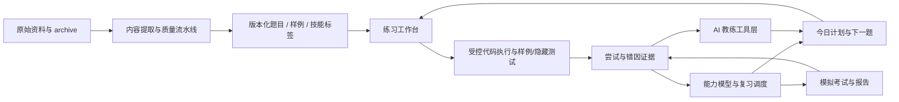

# AI-native 华为 OD 学习教练：技术设计

> 状态：已获产品方向批准；本文是后续分阶段实现的统一技术基线。

## 1. 结论与产品边界

本项目不再定位为“可搜索的 OD 题库”，而是一个以真实练习证据驱动的 OD 备考教练。核心闭环是：

1. 可信题目和可复现测试；
2. 在接近机考的环境中编写、运行和提交代码；
3. 从代码、错误、耗时和历史尝试中识别错因；
4. 给出分级提示而非直接泄露答案；
5. 更新技能掌握度并安排下一项最有效练习；
6. 用限时模拟考试验证能否在压力下稳定完成。

第一阶段仍保持浏览器本地保存和 JSON 导入/导出。账户、云同步、社区与商业化不属于当前技术前提，但数据模型必须能平滑迁移到服务端。

## 2. 设计原则

- **证据优先**：AI 建议必须引用题面、代码、运行结果、失败用例和历史尝试，不基于空泛聊天。
- **诚实判题**：只有结构化样例时明确标注“样例判题”；没有隐藏测试绝不显示“已通过全部测试”。
- **先思考后揭示**：提示分层解锁，完整题解默认隐藏；用户提交或主动确认后再展示对照解法。
- **可解释推荐**：每个推荐题都说明它针对的技能缺口、错因或复习时机。
- **本地优先、接口可迁移**：浏览器仓储实现领域接口；未来服务端只替换仓储和执行适配器，不重写产品逻辑。
- **渐进式可信内容**：先建立 100 道 Golden Problems 的完整质量门槛，再扩展长尾资料。

## 3. 系统架构



### 3.1 内容层

内容构建管线继续从 `archive/original/` 生成 `content/`，新增以下派生信息：

- 结构化样例：标准输入、预期输出、说明、来源定位；
- 题目质量状态：`golden | verified | extracted | index-only`；
- 技能标签与先修关系；
- 语言模板和经验证参考解；
- 版本及去重关系；
- 自动质量报告：缺失字段、不可解析样例、代码无法编译、样例不通过。

Golden Problem 的最低标准：完整题干、明确 I/O、至少一个可判定样例、至少一种可运行参考解、技能标签、来源和人工复核时间。

### 3.2 练习与执行层

练习工作台保留 LeetCode 风格双栏，但行为升级为：

- 每题每语言自动保存代码草稿；
- “运行”只针对当前自定义输入，不改变掌握度；
- “样例提交”依次执行所有可判定样例，比较标准化输出并形成用例矩阵；
- 未来“正式提交”调用私有判题服务执行隐藏测试；
- 每次运行/提交产生不可变的 Attempt，记录代码快照、语言、结果、耗时和失败摘要；
- 失败结果可一键交给 AI 教练，但发送前向用户显示将使用的证据。

输出比较第一版采用：统一换行、去除行尾空白、忽略末尾空行。后续按题目配置精确比较、浮点容差或 Special Judge。

### 3.3 学习与能力层

能力模型不是“做过几题”，而是技能维度上的可解释状态：

```ts
type SkillMastery = {
  skillId: string;
  score: number;          // 0..1
  confidence: number;     // 0..1，证据越多越高
  attempts: number;
  lastPracticedAt: string;
  nextReviewAt: string;
  recentErrorKinds: ErrorKind[];
};
```

初期使用确定性规则，保证结果可测试：首次独立通过加分；多次失败、依赖高级提示、超时分别降低本次证据权重；随时间衰减并按间隔复习调度。拥有足够真实数据后再评估 BKT/IRT，不在冷启动阶段伪装精确。

今日计划由四部分组成：一个薄弱技能题、一个到期复习题、一个迁移题、可选的限时挑战。推荐理由必须可见。

### 3.4 AI 教练层

AI 不是通用聊天窗，而是受领域工具约束的教练：

- `get_problem_context(problemId)`：结构化题面、限制、样例与技能；
- `get_latest_attempt(problemId, language)`：代码、编译/运行结果、失败用例；
- `get_mastery_snapshot()`：相关技能掌握度和历史错因；
- `run_candidate(input)`：在受控执行环境验证假设；
- `record_diagnosis()`：保存错因、提示级别和建议动作；
- `recommend_next()`：从候选题集中做有解释的选择。

提示策略分四级：

1. 苏格拉底式定位：指出应检查的变量、边界或不变量；
2. 算法方向：给出数据结构或复杂度目标；
3. 局部修改：对具体代码块给最小修复建议；
4. 完整解法：用户明确要求或已完成复盘后才展示。

所有 AI 输出需要结构化返回：`diagnosis`、`evidence`、`hintLevel`、`nextAction`、`confidence`。低置信度时必须建议运行验证，而不是断言。

### 3.5 模拟考试层

模拟考试是一个可恢复状态机：

```text
draft -> ready -> running -> paused/recovered -> submitted -> graded -> reviewed
```

关键能力包括题组、倒计时、切题、自动保存、断点恢复、禁止提前泄露题解、统一提交和考试报告。报告不只给总分，还包含时间分配、首次 AC 时间、失败类型、提示依赖、未完成原因和建议复练。

## 4. 核心领域模型

| 实体 | 关键字段 | 说明 |
| --- | --- | --- |
| `Problem` | id, version, sections, skills, quality | 版本化题目，不覆盖旧版本证据 |
| `TestCase` | id, kind, stdin, expected, comparator | `sample/hidden`；浏览器只获得 sample |
| `Draft` | problemId, language, sourceCode, updatedAt | 每题每语言唯一可变草稿 |
| `Attempt` | id, mode, codeSnapshot, results, createdAt | 不可变练习证据 |
| `CaseResult` | caseId, verdict, actual, expected, timeMs | 单用例判定结果 |
| `Diagnosis` | attemptId, errorKind, evidence, hintLevel | AI/规则诊断，可人工修正 |
| `SkillMastery` | skillId, score, confidence, nextReviewAt | 可解释掌握度快照 |
| `LearningPlan` | date, items, reasons | 当日个性化计划 |
| `MockExam` | templateId, state, startedAt, answers | 可恢复考试会话 |
| `ExamReport` | score, timing, errors, recommendations | 模拟考试复盘产物 |

第一阶段浏览器状态单独使用 `od-practice-state-v1` 保存 Draft 和最近 Attempt，避免破坏现有 `od-learning-progress-v1`。统一备份包升级为版本 2，仍兼容导入旧版进度文件。

## 5. API 与适配器边界

前端不得直接依赖 Judge0 数据格式。统一执行接口：

```ts
type ExecutionRequest = { language: ProblemLanguage; sourceCode: string; stdin: string };
type ExecutionResult = {
  kind: 'success' | 'compile-error' | 'runtime-error' | 'timeout' | 'unavailable';
  stdout: string;
  stderr: string;
  timeMs?: number;
};
```

当前公共 Judge0 和私有 gateway 都实现该适配器。生产阶段新增：

- `POST /v1/runs`：自定义输入运行；
- `POST /v1/submissions`：服务端隐藏测试，返回 submission id；
- `GET /v1/submissions/:id`：轮询判题状态；
- `POST /v1/coach/diagnose`：只接受服务端可验证的 attempt id 与用户问题；
- `GET /v1/learning/plan/today`：返回带理由的计划。

## 6. 本地存储与迁移

第一阶段不引入账户。Practice 仓储必须提供纯函数和显式 schema 校验：

```ts
interface PracticeRepository {
  load(): PracticeState;
  save(state: PracticeState): void;
  upsertDraft(draft: Draft): PracticeState;
  appendAttempt(attempt: Attempt): PracticeState;
}
```

仅保留每题每语言最近 20 次 Attempt，避免 `localStorage` 无限增长。备份导入执行 schema、版本、枚举和时间戳校验；失败时不改变当前数据。

未来迁移到后端时使用客户端生成的 UUID 和 `updatedAt` 做幂等上行；Attempt 只追加，Draft 采用 last-write-wins，掌握度由服务端重新计算。

## 7. 安全与可靠性

- 公共 Judge0 只用于本地原型；正式环境必须走私有网关。
- 代码执行设置语言白名单、源码/输入长度、CPU、内存、进程数、网络和速率限制。
- AI 不直接执行任意工具；工具参数服务端校验，隐藏测试永不进入模型上下文。
- 本地备份不包含密钥；AI provider key 不写入静态前端。
- 每个 Attempt 和 AI Diagnosis 记录题目版本，避免题面升级后证据错配。

## 8. 可观测性与质量指标

技术指标：执行成功率、P95 运行耗时、判题不可用率、草稿恢复率、内容质量门槛通过率。

学习指标：首次独立 AC 时间、二次复练通过率、提示级别分布、同类错误复发率、模拟考试完成率。AI 评估集至少包含边界遗漏、输入解析、复杂度超限、状态污染和 off-by-one 五类已知错误，比较诊断证据和建议是否可执行。

## 9. 分阶段交付

### Phase 1：可信练习闭环

结构化样例、代码草稿、运行/样例提交分离、用例矩阵、Attempt 历史、统一备份。验收：刷新不丢代码；至少一个样例可正确判定 pass/fail；产品不夸大隐藏测试能力。

### Phase 2：OD 能力图和自适应计划

Golden 100、技能 taxonomy、确定性掌握度、错题本、间隔复习、今日计划。验收：每次推荐均有可追溯理由，历史相同输入得到确定结果。

### Phase 3：证据驱动 AI 教练

受控工具、分级提示、失败诊断、复杂度反馈、复盘卡片和评估集。验收：AI 引用真实证据；不读取隐藏答案；低置信度不做确定断言。

### Phase 4：OD 机考模拟

题组、倒计时、断点恢复、统一提交、隐藏测试、能力报告。验收：刷新可恢复考试；考试中不泄露题解；报告能回到具体尝试和技能缺口。

## 10. 当前明确不做

在上述闭环成立前，不优先做社区、排行榜、付费墙、简历服务、通用 Agent 市场或花哨的游戏化资产。勋章和连续学习只作为对有效学习行为的反馈，不能替代真实能力证据。
