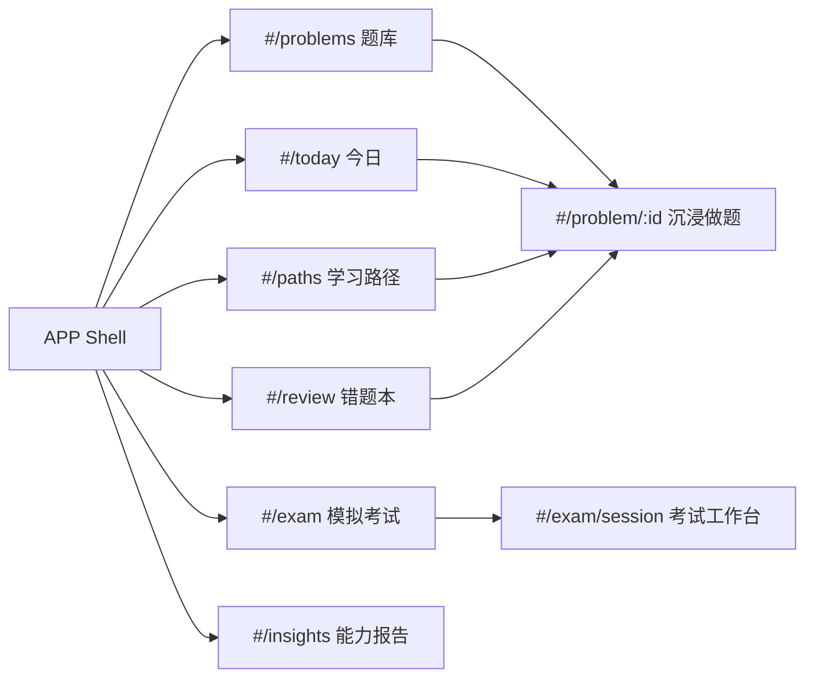
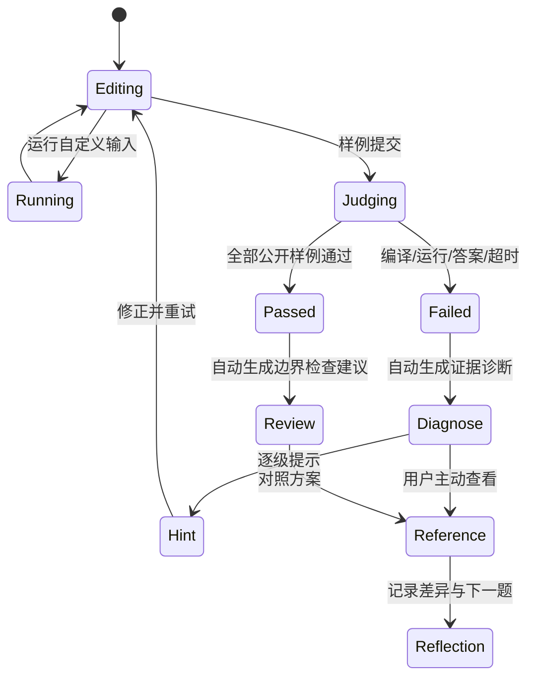

# OD 学习教练 APP Shell 与 AI 学习闭环设计

> 状态：用户授权产品负责人选择最优方案并直接执行。本文是本轮重构的产品与技术基线。

## 1. 产品结论

产品不再呈现为“一个很长的题库网页”，而是一个以每日行动为入口、以做题证据驱动后续学习的浅色桌面 APP。

唯一采用的方案是：

1. 桌面端固定左侧导航，移动端改为底部导航；
2. 今日、题库、学习路径、错题、模拟考试、能力报告分别拥有独立路由；
3. 首页只回答“我现在应该做什么”，不承担题库、路径与报告的完整展示；
4. 进入题目后隐藏常规 APP 导航，进入 LeetCode 式沉浸工作台；
5. 一次样例提交后，系统按“判定 → 证据 → 错因 → 下一步 → 参考答案”组织反馈；
6. AI 是学习状态机的一部分，不是一个孤立聊天框。

## 2. 方案比较与选择理由

| 方案 | 优点 | 缺点 | 决策 |
| --- | --- | --- | --- |
| 顶部横向导航 | 实现简单、内容宽 | 六个模块拥挤，层级弱，仍像网站 | 不采用 |
| 左侧 APP Shell | 模块稳定、可扩展、桌面学习工具感强 | 小屏需要单独适配 | **采用** |
| AI 命令中心单入口 | 概念新、交互集中 | 可发现性差，冷启动和无 AI 服务时脆弱 | 暂不采用 |

## 3. 信息架构与路由

### 3.1 今日

- 顶部是“AI 学习简报”，只展示一个最推荐动作、推荐理由和预计耗时；
- 下方最多三项今日队列；
- 展示三个轻量指标：连续学习、到期复习、有效提交；
- 不展示完整题库、完整路径、完整能力图或大段营销 Hero。

### 3.2 题库

- 搜索、筛选、总量和结果列表独立成页；
- 列表展示题目状态、分值、语言、技能与是否有可判定样例；
- 个性化推荐仅以一条简洁提示出现，不盖过检索任务。

### 3.3 学习路径

- 每条路径展示目标、进度、技能范围和下一题；
- 点击进入路径详情或直接开始下一题；
- 本轮复用现有路径数据，先完成独立页面和清晰层级。

### 3.4 错题本

- 只展示需要复练的失败提交；
- 按“已到期 / 计划中”分组；
- 卡片包含最近错因、语言、失败时间与复练按钮。

### 3.5 模拟考试

- `#/exam` 是考试入口与历史状态，不直接把用户扔进工作台；
- 开始或继续后进入 `#/exam/session`；
- 考试工作台保持沉浸模式，不展示题解和 AI 教练。

### 3.6 能力报告

- 展示有证据的技能掌握度、置信度、弱项和推荐行动；
- 明确区分“没有证据”和“低掌握度”；
- 不伪造精确 AI 分数。

## 4. 题目工作台

### 4.1 布局

- 顶部 56px 工具栏：返回、题目标题、上一题/下一题、运行、提交；
- 主区左右双栏，可拖动不是本轮必需；
- 左侧：题目、提交记录、参考答案三个标签；
- 右侧：浅色 Monaco 编辑器，上半编辑器、下半测试与学习反馈；
- 任何区域都不使用暗色大背景。

### 4.2 参考答案规则

- 原始资料中的 `sections.solution` 与 `solutions[language]` 统一视为参考答案；
- 参考答案不再出现在普通“解题思路”标签中；
- 未做样例提交时点击“参考答案”，先出现一次确认：“查看后本次练习会标记为已参考答案”；
- 有过样例提交后可直接查看；
- 解锁状态仅保存在当前组件会话，本轮不扩展备份 schema；
- 参考答案页分为解题思路、复杂度、对应语言代码；缺失部分诚实提示。

## 5. 提交后的 AI Native 闭环

提交结果区必须同时提供：

- 清晰判定与通过数量；
- 失败用例的输入、预期、实际输出或 stderr；
- 一张默认展开的“教练诊断”卡，引用本次证据；
- 三个明确动作：修正并重试、给我一个提示、查看参考答案；
- 已通过时也给边界与复杂度检查，而不是只显示绿色成功。

模型服务未配置或不可用时，继续使用确定性证据诊断，并清楚标注“本地诊断”；不得出现空白 AI 页面。

## 6. 视觉系统

### 6.1 三层 Token

- Primitive：灰阶、品牌蓝、成功绿、警告橙、错误红、AI 紫；
- Semantic：canvas/surface/text/border/action/status/ai；
- Component：sidebar、nav-item、card、button、judge-result、coach-card、editor-tabs。

组件禁止直接新增原始十六进制颜色。语义限制：

- 品牌蓝：导航选中、主要按钮、焦点；
- 成功绿：仅通过与正向状态；
- 错误红：仅失败与危险操作；
- 警告橙：仅注意与未验证；
- AI 紫：仅 AI 身份标识和极浅背景，不用于普通按钮。

### 6.2 视觉基线

- 全站浅色，画布为冷灰白，内容卡片为白色；
- 字体使用系统无衬线中文栈，代码使用等宽字体；
- 圆角 8/12/16px 三档，不使用夸张 28px 营销卡；
- 阴影只表达层级，不使用发光、轨道、深色渐变背景；
- 正文宽度、行高和 `pre` 换行规则保证题面可读；
- 所有交互具备键盘焦点与 4.5:1 文字对比度目标。

## 7. 技术设计

- 不新增路由依赖，建立纯 TypeScript hash route parser，统一导航与激活态；
- `App.tsx` 只负责数据装载、持久化与顶层路由，页面拆到 `pages/`；
- 新建 `AppShell` 管理侧栏、移动导航、备份入口与页面标题；
- 复用现有 catalog/progress/practice/mastery/daily-plan 纯函数；
- 将参考答案解锁策略抽为纯函数测试；
- 将提交后主动作与诊断请求留在 `RunnerPanel`，但拆出 `SubmissionFeedback` 和 `ReferenceSolution` 降低复杂度；
- 保持 localStorage 与导入导出兼容，不修改现有数据 key。

## 8. 验收标准

1. `#/today`、`#/problems`、`#/paths`、`#/review`、`#/exam`、`#/insights` 均可直接访问和刷新；
2. 六个页面不再同时出现在首页；
3. 桌面端左侧导航有明确激活态，移动端可完成同样导航；
4. 全站不存在以暗色作为大面积页面/编辑器背景的默认主题；
5. 题目页保持左右双栏，题面排版不把整段内容挤成代码样式；
6. 参考答案独立呈现，首次提前查看有确认；
7. 样例提交后默认看到判定、证据、教练诊断与三项下一步动作；
8. AI 服务缺失时仍有可用的本地证据诊断；
9. 现有草稿、进度、尝试记录与备份兼容；
10. 单元测试、组件测试、lint、typecheck、build 与真实浏览器主流程通过。

## 9. 非目标

- 本轮不引入账号、云同步、社区、付费、版权治理；
- 本轮不实现可拖动分栏和复杂动效；
- 本轮不伪造未接入的隐藏测试或正式 AC；
- 本轮不把所有旧组件一次性重写。
