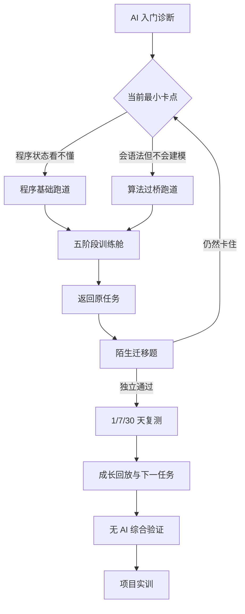

# TIA 算法过桥课程体系与完整用户流程设计

> 日期：2026-08-14
>
> 状态：产品与架构设计评审版
>
> 对应 OpenSpec：`build-algorithm-bridge-curriculum-journey`

## 一句话结论

TIA 不能只做算法题，也不能再做一套传统网课。正确产品形态是：

> **用真实任务发现用户具体卡在哪里，在需要的那一刻教最少但足够的内容，再用陌生题和延迟复测证明他真的学会。**

算法题是入口和验证工具，课程是能力形成工具，AI 是持续诊断、选择教学动作和调整路径的导师。三者必须是同一条用户流程，不能分成互不相干的题库、课程中心和聊天框。

## 1. 我们具体解决什么问题

目标用户通常不是“完全没看过算法”，而是陷在下面的循环里：

1. 看课程时觉得听懂了；
2. 一打开陌生题就不知道怎么开始；
3. 看答案后又觉得自己会了；
4. 换一个题面仍然不会；
5. 最后把失败归因于自己基础差、数学差或不适合学技术。

TIA 要解决的不是“给他更多内容”，而是修复三个断点：

- **理解断点**：专业术语太早，用户看不见程序到底在做什么。
- **行动断点**：知道概念，却不能把题意变成状态、步骤和代码。
- **掌握幻觉**：当前题在帮助下通过，就误以为自己已经掌握。

产品承诺不是“帮你做出这道题”，而是：

> **让你用越来越少的帮助，独立做出下一道陌生题。**

## 2. 首批用户与产品边界

### 首批用户

- 非计算机专业或计算机基础薄弱；
- 想申请 AI 应用、算法或其他需要编码筛选的技术岗位；
- 可能只会一点 Python，也可能已经能写循环和函数；
- 学过课程或刷过题，但不能稳定独立解决陌生基础题；
- 每天能投入 20–60 分钟，希望看到明确进步。

### 本阶段不解决

- 不把用户直接培养成完整的大模型算法工程师；
- 不教授完整高等数学、机器学习、深度学习和模型训练；
- 不保证录用、薪资或进入某家公司；
- 不用完成课时、连续打卡或刷题数量冒充能力；
- 不把“会算法题”说成“能胜任真实工程工作”。

算法过桥之后，用户还要进入项目实训，形成真实工程证据。那是下一阶段，不与算法筛选能力混为一谈。

## 3. 产品结构：不是课程目录，而是一条过桥路线

课程有三个入口，但只有一套进度：

- **今日训练**：系统直接安排今天最值得做的一小步。
- **学习地图**：用户查看整条路线、先修关系和自己的证据状态。
- **真实练习中的补课**：Mentor 发现具体卡点后，拉出一节最小课程，完成后回到原题。

题库继续保留搜索和自由练习，但不再是新用户的默认首页，也不负责解释学习路径。

## 4. 课程体系

### 第一段：让程序跑起来

适合几乎零基础或语法很不稳定的用户。

| 模块 | 用户真正要会的事 | 不是为了背什么 |
| --- | --- | --- |
| 执行顺序 | 看懂程序从哪一行走到哪一行 | 术语定义 |
| 变量与状态 | 知道这一刻程序记住了什么 | 数据类型大全 |
| 条件与循环 | 能预测下一步走哪条路、循环变量是什么 | 语法速查表 |
| 函数 | 看懂输入、处理和返回值 | 复杂语言特性 |
| 列表与字符串 | 能逐个读取、修改和组合数据 | API 背诵 |
| 输入输出 | 把题目给的数据变成程序可用的值 | 平台模板抄写 |
| 调试 | 用错误信息和小测试定位问题 | 猜答案 |

### 第二段：把题意变成步骤

这是传统课程最容易缺失、又最影响非科班学习者的一段。

- 题目到底给了什么、要求什么；
- 用一个最小样例手推过程；
- 哪些信息会变化，哪些始终不变；
- 先写出能工作的朴素方案；
- 怎样估算时间和空间；
- 边界条件如何变成测试；
- 如何把自然语言步骤翻译成函数和循环。

### 第三段：高频算法模式

首批正式落地顺序：

1. 数组与字符串遍历；
2. 哈希记录与查找；
3. 双指针；
4. 滑动窗口；
5. 栈与队列；
6. 排序与二分；
7. 前缀和、差分与区间；
8. 堆与 Top K。

每个模式都从“什么时候会遇到这种问题”开始，而不是从模板开始。用户必须能说清：保存什么状态、为什么移动、什么时候停止、什么输入会出错。

### 第四段：结构与搜索

- 递归与回溯；
- 树的遍历；
- 图、BFS 与 DFS；
- 贪心的选择依据；
- 动态规划的状态与转移入门。

这部分先进入完整地图，只有经过人工审核且有可信迁移任务的节点才开放学习。

### 第五段：陌生题综合迁移

- 不显示题型标签；
- 不提供模板；
- 混合多个基础技能；
- 限时实现；
- 需要解释状态、复杂度和边界；
- 最终在无 AI 模式完成综合验证。

## 5. 每个学习单元只有五步

### 第一步：先用人话听懂

只解释一个目标。例如双指针不是先讲模板，而是说：“两个人站在队伍两端，根据当前结果决定谁往中间走，每走一步都排除一批不可能答案。”

### 第二步：看见程序状态

用户看到 `left`、`right`、当前值、已见集合或队列怎样变化。这里展示的是可核对的示例状态，不是装饰性“AI 正在思考”。

### 第三步：先预测再运行

用户先回答“下一步哪个变量会变、为什么”，再运行揭晓。预测错误时，系统指出具体误区，不扣分，也不直接公布模板。

### 第四步：只写关键一步

用户先完成一个局部动作，例如更新指针、写判断条件或保存状态。目的是证明理解，不是让他一开始就面对 50 行代码。

### 第五步：换一个题面独立迁移

系统打开一个表面不同但技能相同的任务。这里才开始判断是否会用。课程答案不能直接复制成该题解法。

## 6. 完整用户流程

### 6.1 第一次打开：一分钟内感到 AI 在理解自己

用户只回答必要信息：目标岗位/考试、预计时间、每天可投入时间、首选语言。随后完成三个短动作：

1. 预测一段小程序下一步状态；
2. 补一行基础代码；
3. 用自己的选择说明一道简单题该保存什么信息。

AI 结果不能说“你是视觉型学习者”之类无法证明的话，而要说：

> “你能写基础循环，但刚才两次都能执行代码，却没有先说明循环中的状态。我暂时判断，你最需要补的不是语法，而是把题意变成状态。这个判断来自刚才的两个动作，仍需要在真实题里确认。接下来用 10 分钟练一次。”

### 6.2 第一次 10 分钟训练

用户直接进入训练舱，不经过题库首页。完成解释、可视化、预测和局部编码后，进入一个真实但难度可控的迁移任务。

### 6.3 做题时卡住

Mentor 先读取当前提交快照、运行结果和工具证据。它不马上给“这是一道哈希题”，而是用最少动作确认卡点：

- 让用户预测某轮变量；
- 运行一个能区分两种原因的测试；
- 询问当前计划；
- 检查错误行或状态变化。

确认后只补最小先修。例如用户不是不会哈希，而是不明白“已经见过的数据”该在什么时候保存，就只补这一节点。完成后返回原题，草稿和上下文都还在。

### 6.4 当天完成后

成长回放不用空洞分数，而是展示：

- 今天最初卡在哪里；
- AI 根据什么做了判断；
- 用户完成了哪些可验证动作；
- 哪一步是在帮助下完成；
- 是否已经通过陌生迁移；
- 还需要哪次延迟复测；
- 明天为什么练下一项。

### 6.5 一周后

系统安排不同表面的延迟复测。通过才说明知识保留下来；失败不会抹掉历史，而是指出忘在什么环节，安排一个更短的刷新任务。

### 6.6 算法过桥出口

用户达到核心技能的独立迁移要求后，参加无 AI 综合验证。考试关闭 Mentor、课程答案、参考解和历史解法；任务不显示题型标签。报告分别展示理解、建模、实现、调试、验证、独立性、提示依赖和保持情况。

通过的含义是“已经跨过当前定义的算法筛选基础门槛”，不是“已经能胜任算法工程师”。下一步进入项目实训，验证真实工程应用。

## 7. 用户如何直接感知这是 AI 产品

AI 不能只藏在一个聊天 Tab。用户在三个关键时刻直接看到它的价值：

### 训练前：AI 说明为什么是这一步

- 我观察到了什么；
- 我依据哪次动作或提交；
- 目前最可能的问题；
- 还不确定什么；
- 为什么接下来只练这一项。

### 训练中：AI 根据行为改变教学动作

- 预测错了，AI 指向具体状态；
- 运行结果推翻假设，AI 重新规划；
- 证据不足，AI 主动生成区分性测试；
- 用户已经会了，AI 缩短讲解并提前进入迁移；
- 用户依赖高等级提示，AI 不把当前通过算成独立掌握。

### 训练后：AI 用证据解释成长

- 哪个误区减少了；
- 哪项能力仍缺证据；
- 为什么安排 1/7/30 天复测；
- 哪些结论来自规则，哪些只是模型建议；
- 下一步完成什么才会改变计划。

这比“给一段看起来聪明的回答”更 AI 原生，因为系统真正根据用户行为改变了后续学习环境。

## 8. 学习证据与掌握规则

产品必须区分以下状态：

| 状态 | 可以说明什么 | 不能说明什么 |
| --- | --- | --- |
| 看完解释 | 接触过概念 | 会使用 |
| 完成局部编码 | 理解一个动作 | 能解决完整问题 |
| 当前题通过 | 这次任务成功 | 独立掌握 |
| 帮助后迁移通过 | 在帮助下能完成 | 无帮助也会 |
| 陌生迁移独立通过 | 能在新题面使用 | 已长期保持 |
| 延迟复测通过 | 一段时间后仍会 | 完整岗位胜任 |
| 无 AI 综合验证通过 | 达到定义的算法筛选门槛 | 能完成真实工程工作 |

模型不能直接改掌握度。只有带技能、时间、帮助等级、任务版本、判定和证据引用的事件，才能由确定性规则更新学习状态。

## 9. 产品页面如何分工

- **今日训练**：只回答“今天最值得做什么，为什么”。
- **训练舱**：只完成一个最小认知闭环。
- **题目工作台**：真实实现、运行、提交和上下文 Mentor。
- **学习地图**：查看课程全貌、先修关系和证据状态。
- **错因复练**：处理到期复测和反复误区。
- **能力报告**：解释成长和缺口，不负责教学操作。
- **算法初试**：独立验证或单独的 AI 协作能力验证。
- **项目实训**：算法过桥后的真实工程应用。

页面之间通过同一个学习会话和事件流连接，不通过文案假装连贯。

## 10. 第一实施阶段的边界

第一阶段不是一次性填满全部课程，而是先让整条路径真实走通：

### 必须完成

- 入门诊断与双跑道分流；
- 统一课程图谱与课程版本；
- 程序基础、问题建模和 6 个高频模式的可用节点；
- 五阶段训练会话与跨设备恢复；
- 练习失败到最小补课再回原题；
- 帮助预算、陌生迁移和延迟复测；
- 多维准备度报告；
- 无 AI 综合验证入口与隔离策略。

### 可以后续扩展

- 树、图、贪心、动态规划的完整内容；
- 模型批量生成并经过人工晋级的迁移题；
- 课程讲解者社区；
- 企业岗位校准；
- 多语言教学内容，而非仅多语言答题。

## 11. 判断产品是否真的变好

第一阶段不以页面数或课程数验收，至少跟踪以下结果：

1. 新用户从打开到第一次有意义运行的中位时间；目标小于 3 分钟。
2. 用户能否用自己的话说清“为什么今天练这一项”。
3. Mentor 给最小提示后，用户是否能自己修改并通过，而不是复制答案。
4. 相同技能、不同题面的独立迁移通过率。
5. 7 天延迟复测通过率。
6. 每个计划变化是否都有事件和证据引用。
7. 高等级提示后被错误计为独立掌握的比例；目标为 0。
8. 用户完成算法过桥后进入项目实训并产出有效工程证据的比例。

这些指标要先作为产品遥测和实验目标，不得在没有真实数据时写成已达成成果。

## 12. 已确定的产品决策

- 要有课程，但课程嵌在任务中，不做独立网课孤岛。
- 同时服务零基础和会基础 Python 的用户，但共用一张图谱。
- 先用 Python 降低教学语法负担，迁移和考试继续支持多语言。
- 题库是训练材料层，不是产品的主导航和价值主张。
- Mentor 选择教学动作，但事实、答案和掌握由可信内容与证据规则约束。
- 当前题通过不等于掌握；陌生迁移和延迟复测才是核心结果。
- 算法过桥是求职入口能力，不是完整 AI 算法工程师培养的终点。

## 13. 规格索引

- `algorithm-bridge-curriculum`：课程图谱、节点合同、内容可信。
- `adaptive-bridge-journey`：诊断、分流、Today 与跨页面连续性。
- `just-in-time-remediation`：从失败到最小补课再回原题。
- `mastery-retention-verification`：帮助预算、迁移、复测与掌握投影。
- `bridge-readiness-outcome`：无 AI 综合验证、报告和项目实训出口。

正式可测试场景位于：

`openspec/changes/build-algorithm-bridge-curriculum-journey/specs/`
