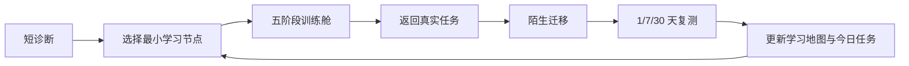

## Context

TIA 当前已经具备 754 道题、代码执行、单一 Mentor、12 节基础课、3 节高频算法微课、五阶段训练舱、迁移事件、延迟复测和服务端学习事件投影。问题不在于缺少单点功能，而在于这些功能尚未共同回答学习者的核心问题：我应该从哪里开始、为什么练这一项、卡住时学什么、怎样确认自己不是“看懂了答案”，以及何时可以进入真实面试和项目。

本变更服务两类首要用户：几乎没有编程基础的人，以及会基础 Python 但无法独立解决陌生算法题的人。两类用户共享同一能力图谱，但根据诊断证据从不同节点进入。Python 仍是第一教学语言，算法概念、状态可视化和能力证据保持语言中立；Java、JavaScript 和 C++ 在迁移与考试阶段继续可用。

本设计必须复用现有身份、学习事件、Mentor、Runner/Judge、题库和路由，不建立第二套课程账户、第二个进度数据库或另一个聊天机器人。

## Goals / Non-Goals

**Goals:**

- 把“诊断—最小学习—真实练习—迁移—延迟复测—阶段验证”变成唯一的算法过桥主流程。
- 为零基础和已有语法基础的用户提供不同起点，而不是不同产品。
- 建立可版本化、可校验、可追溯的课程图谱和统一训练单元。
- 让 AI 个性化在第一分钟和每次训练中可见，同时保证事实、答案和掌握结论不由模型随意决定。
- 用陌生迁移、延迟复测和无 AI 综合任务衡量独立能力，而不是用课时、刷题数或当前题 AC 代替掌握。
- 将算法过桥结果连接到后续项目实训，但不把算法题能力包装成完整岗位胜任力。

**Non-Goals:**

- 不建设视频平台、课程商城、讨论社区、招聘平台或完整计算机科学学位。
- 不覆盖竞赛算法、研究级算法、机器学习数学、深度学习或大模型训练课程。
- 不允许模型即时生成未经验证的正式课程、参考答案或掌握分数。
- 不承诺固定周期、录用、薪资或“人人成为算法工程师”。
- 不在本变更中替换现有 Judge、Mentor OS、身份系统或题库构建链。

## Decisions

### 1. 采用一条学习主线，而不是“课程区 + 题库区”两个孤岛

用户可以从 Today、学习地图或练习失败进入课程，但课程完成后必须返回真实任务；题库则作为训练材料库存在，不再承担教学路径本身。主循环如下：

备选方案是建立传统章节目录，让用户先学完再刷题。该方案实现简单，但会延续“课程看懂、换题不会”的断裂，因此不采用。

### 2. 一次诊断，两个入口跑道，同一套课程图谱

首次诊断包含目标与时间、基础语法小任务、程序状态预测、简单建模和一次最小编码。系统形成带证据与不确定性的 `DiagnosticSnapshot`，将用户放入以下入口之一：

- **程序基础跑道**：尚不能稳定理解变量、分支、循环、函数、列表/字符串、输入输出和基本调试。
- **算法过桥跑道**：语法足以完成小程序，但在题意建模、数据结构选择、边界、实现或调试上卡住。

诊断只是起点建议，不是永久标签。用户可跳过推荐节点接受一次挑战；通过后跳级，失败后返回最小先修。备选方案是按自报水平分班，但自报容易失真，故只作为弱信号。

### 3. 课程图谱分五段，节点而非长课是最小教学单位

目标课程图谱分为五段：

1. **让程序跑起来**：执行顺序、变量、条件、循环、函数、输入输出、列表、字符串、调试。
2. **把题意变成步骤**：输入输出、样例手推、状态、朴素方案、复杂度、边界与测试。
3. **掌握高频模式**：数组/字符串、哈希、双指针、滑动窗口、栈/队列、排序、二分、前缀/差分、区间、堆。
4. **进入结构与搜索**：递归、回溯、树、图、BFS/DFS、贪心、动态规划入门。
5. **陌生题综合迁移**：混合题型、限时实现、口述解释、无 AI 模拟和错因复练。

每个 `CurriculumNode` 必须声明版本、先修节点、技能、可观察目标、典型误区、5–10 分钟教学活动、迁移约束、复测间隔、可信等级和内容哈希。课程图谱必须无环，引用的技能与练习必须存在。模型生成的类比、反例和变式只能以 candidate 身份进入，经自动执行和人工审核后才可用于正式掌握验证。

### 4. 所有教学节点使用同一五阶段状态机

一个 `TrainingSession` 只推进一个认知目标，并按以下顺序运行：

1. **听懂**：用普通中文和生活类比说明“这一步解决什么”。
2. **看见**：展示变量、指针、容器或搜索范围怎样变化。
3. **预测**：用户先判断下一步状态，再看到结果。
4. **动手**：只补关键代码或修一个局部错误。
5. **迁移**：进入不同题面的真实任务，不提供可复制模板。

阶段只能由可验证动作推进，刷新后可恢复；错误回答允许重试，不扣“分”，但记录误区证据。该状态机复用现有 Training Cabin，不再建设第二个 Lesson Player。

### 5. 补课是一次可恢复的任务分支

当真实练习失败时，系统从提交快照、运行结果、工具证据和已知先修中形成诊断。如果证据足够，生成 `RemediationLink`：原任务、原尝试、目标技能、推荐节点、原因和恢复位置。用户完成最小补课后返回同一题、同一语言和原草稿，并清楚看到“刚才学的动作如何用于这里”。

如果证据不足，Mentor 必须先收集最小证据（运行一个测试、让用户预测状态或说明计划），不得凭题目标签直接断言具体错因。若没有可信课程映射，只能推荐通用调试步骤，不能伪造精准补课。

### 6. 将任务成功、课程完成和能力掌握分开

系统保留三个互不替代的事实：

- `taskSuccess`：这次提交通过，可能受过帮助。
- `lessonCompletion`：教学步骤已完成，不代表独立掌握。
- `masteryEvidence`：在受控帮助预算内完成陌生迁移或延迟复测。

技能状态采用可解释等级：`未接触 → 正在学习 → 有帮助完成 → 独立迁移 → 延迟保持 → 阶段就绪`。普通样例通过、看过参考答案或高等级提示不能直接升级掌握；无提示且经可信测试判定的迁移与复测才可升级。模型只能提出候选解释，最终投影由确定性规则根据事件和证据引用计算。

### 7. Mentor 负责选择教学动作，不负责替用户完成

Mentor 在每个会话中只输出一个下一步，并展示：观察到什么、最可能的卡点、证据是否足够、刚做了什么验证、建议只改哪里、修改后是否验证。它可以选择检索课程、检查 AST/运行结果、生成候选测试、请求预测、给最小提示或建议补课；不能自动把完整解法写入编辑器。

帮助按四级预算记录：定位、思路、局部修改、完整参考。迁移验证默认关闭第 3–4 级帮助，正式无 AI 验证关闭全部 Mentor、检索和参考内容。DeepSeek 不可用时保留确定性课程和本地证据规则，并明确显示降级状态，不伪装为在线 Agent。

### 8. 让个性化在三个界面直接可见

- **首次诊断结果**：说明“目前最可能卡在哪里、依据是什么、还不确定什么、接下来 10 分钟做什么”。
- **训练舱持续导师**：随预测、运行和修改更新同一时间线，而不是弹出泛聊天窗口。
- **成长回放与训练地图**：显示起点、今日证据、仍未掌握的环节、下一任务及其原因，并允许展开贡献账本。

每个 Today 任务都必须显示目标、预计时间、先修、完成收益和推荐原因；冷启动必须标为基线安排，不能伪称深度个性化。

### 9. 复用权威事件流并新增过桥投影

客户端把结构化教学动作写入现有 pedagogical event/outbox，服务端校验身份、枚举、技能、课程版本和证据引用后持久化。新增逻辑领域对象为：

- `DiagnosticSnapshot`
- `BridgePlan`
- `TrainingSession`
- `RemediationLink`
- `AssistanceEvent`
- `VerificationAttempt`
- `BridgeReadinessSnapshot`

这些对象优先由不可变事件投影得到；诊断快照、计划和准备度保留生成版本与证据引用。离线时允许继续使用已缓存的人工审核课程和本地草稿，恢复联网后幂等同步；涉及服务端判题、在线 Mentor 或跨设备权威进度的动作必须标记“待同步/不可验证”，不能离线伪造完成。

### 10. 过桥出口由多项证据组成，不使用一个神秘总分

阶段报告分别展示题意理解、建模、实现、调试、验证、独立性、提示依赖和延迟保持。进入最终无 AI 综合验证前，关键先修必须至少达到“独立迁移”，且到期复测没有未处理的高风险缺口。

“算法过桥完成”要求学习者在无 AI、无参考答案、无题型标签的条件下完成一组陌生综合任务，并口述关键状态、复杂度和边界。通过只表示跨过当前算法筛选基础门槛；系统随后推荐项目实训，以验证真实工程应用能力，不宣称完整岗位胜任。

## Risks / Trade-offs

- **[课程范围过大，长期停留在目录建设]** → 先实现可走通的基础跑道、建模段和 6 个高频模式，再按真实卡点扩展；每批内容都必须带迁移任务。
- **[诊断过短，错误分流]** → 明示不确定性，允许挑战跳级，并根据前三次真实任务重新规划。
- **[AI 看起来仍像提示器]** → 把观察、工具、证据、计划变化和验证结果放在主流程中；但不以炫技替代教学结果。
- **[帮助限制让初学者挫败]** → 允许逐级请求帮助，但如实记录帮助预算，并安排新的独立迁移，不用惩罚性语言。
- **[题目技能标签或课程映射错误]** → 只有 human-reviewed 映射可用于正式推荐和掌握判断；candidate 映射只用于内部审核。
- **[事件模型继续分裂]** → 以服务端 pedagogical event 为长期合同，旧 learner-memory 事件通过兼容适配读取，不再新增第三套进度模型。
- **[课程完成被误解为就业能力]** → 报告明确区分算法筛选准备度、工程项目证据和岗位胜任，算法过桥只负责第一层。
- **[离线或模型故障导致路径中断]** → 人工审核课程、训练状态和本地 Runner 保持可用；需在线验证的结论保持 pending。

## Migration Plan

1. 冻结课程、技能、帮助等级、掌握等级和事件枚举，给现有 12+3 节课程加版本与可信元数据。
2. 建立统一课程图谱适配层，把现有 Foundation/Starter 课程合并为一个只读目录，不改旧深链。
3. 增加入门诊断和 `BridgePlan` 投影；Today 先对新用户启用，旧用户继续使用现有计划并可主动加入。
4. 将 Training Cabin 接入统一会话与恢复合同，再接入题目失败后的 `RemediationLink`。
5. 接通迁移、延迟复测和准备度投影；在未具备可信判题时保持“待验证”。
6. 完成无 AI 综合验证与项目实训出口后，才把“算法过桥”设为默认新用户主路径。
7. 回滚时关闭算法过桥入口，保留旧路由和所有加法事件；新事件可被旧客户端安全忽略，课程版本不可原地篡改。

## Open Questions

- 第一批正式内容建议止于“程序基础 + 问题建模 + 数组/哈希/双指针/滑动窗口/栈队列/二分”，后续节点先进入地图但不标记可学习；实施计划必须按这一边界拆批。
- 真实教学效果仍需通过目标用户实验验证。规格能保证证据诚实和流程可测，但不能提前证明 TIA 优于其他教学方式。
